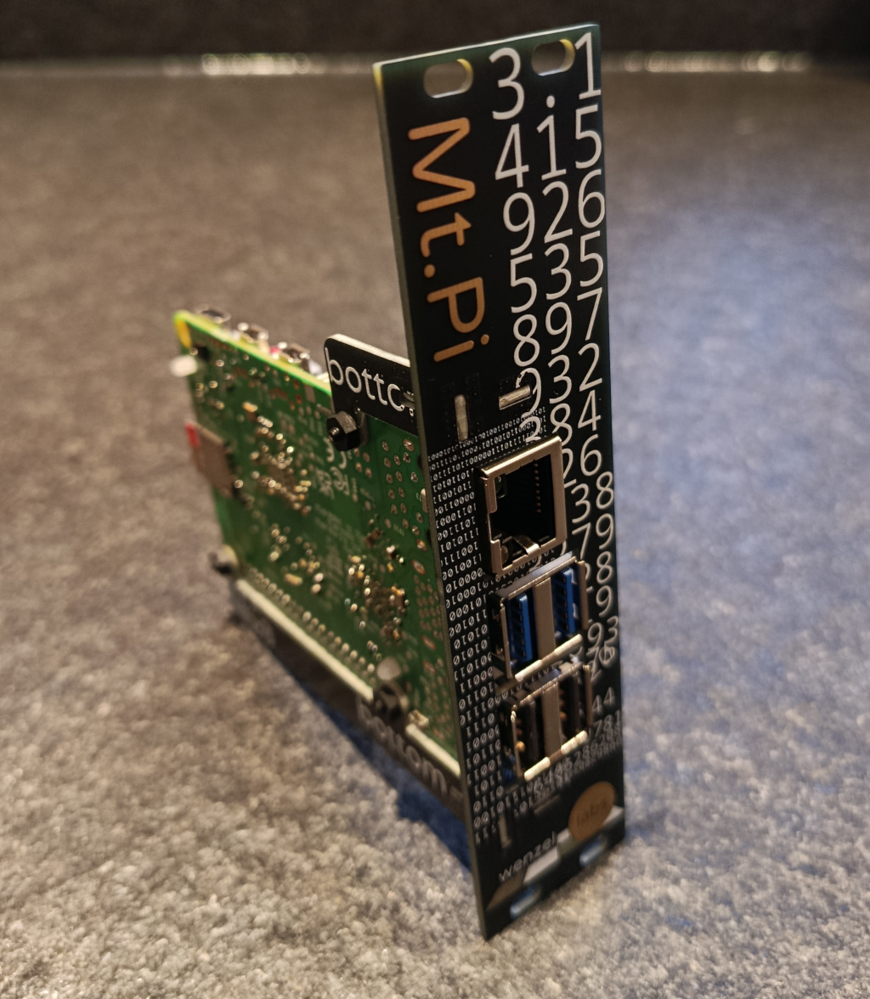
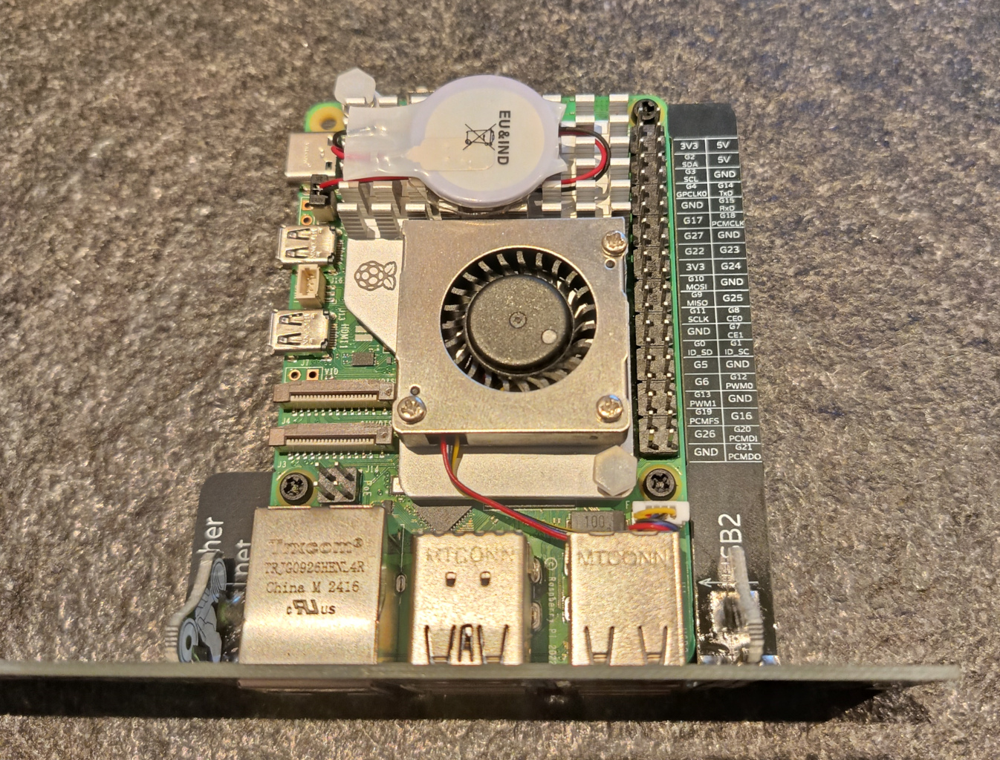
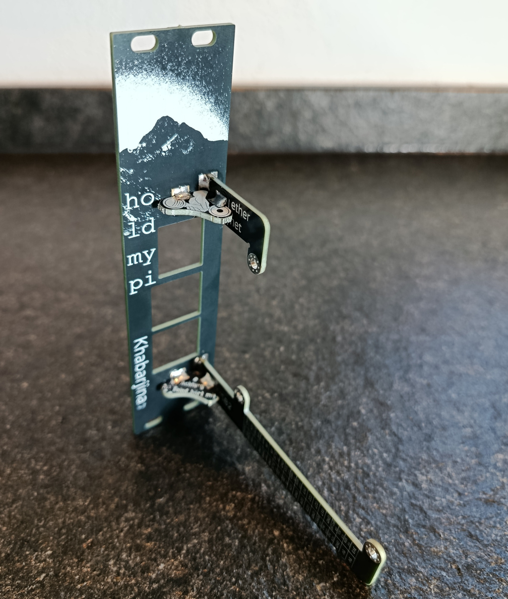

# Mt. Pi

## a eurorack mount for the Raspberry Pi

compatible with Raspberry Pi 3.

compatible with Raspberry Pi 5.

NOT compatible with Raspberry Pi 4.

purchase at [my little shop over at lectronz](https://lectronz.com/products/mtpi) or for US, Canada and other worldwide markets through [Modular Addict](https://modularaddict.com/shop-by-brand/wenzel-labs).

## tech bits

- 6 HP wide (30.48mm)
- 88mm deep (basically the Raspberry Pi + micro SD card)
- weight: 16g
- useful pinout description next to the Pi pins
- it’s a kit. there’s no pre-soldered version.
- there’s no power supply. you need to connect 5V through
	USB-C or the pin headers yourself.
- compatible with
	- Raspberry Pi 5
	- Raspberry Pi 3

- NOT compatible with
	- Raspberry Pi 4 (which has swapped eth and USB2 jacks)
	- cutting holes in the frontpanel might make it compatible

## assembling the kit

there's a [detailed assembly manual for the Mt. Pi](https://github.com/wenzellabs/Mt.Pi/raw/main/Mt_Pi_assembly_instructions.pdf).

## tools required

- Philips screwdriver for the M2.5 nylon screws
- soldering iron + solder
- Raspberry Pi

## purchase

get it at [my little shop over at lectronz](https://lectronz.com/products/mtpi) or for US, Canada and other worldwide markets through [Modular Addict](https://modularaddict.com/shop-by-brand/wenzel-labs).

#### seo

- eurorack
- raspberry pi
- raspberrypi
- raspi
- rpi
- sonicpi
- DIY
- linux
- synth
- synthesizer

